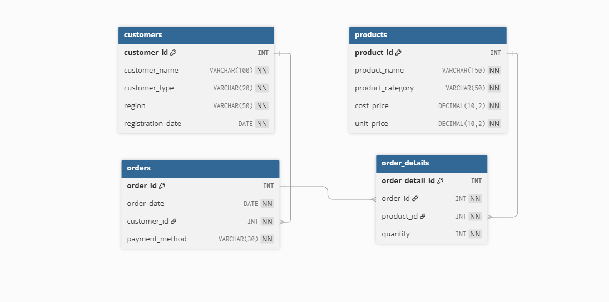

# Shapla Retail Ltd – Sales & Profit Analysis (SQL Server + Tableau)

## 📊 Project Overview
This project analyses the sales and profitability performance of Shapla Retail Ltd., a Bangladesh-based FMCG & Electronics distributor operating across Dhaka, Chattogram, Khulna, and Rajshahi.

The goal of this analysis is to support management decision-making through:
- Revenue performance tracking
- Profitability analysis
- Customer segmentation insights
- Regional performance evaluation
- Executive dashboard visualisation

## 🎯 Business Problem
Shapla Retail Ltd. wants to answer:
- Which region generates the highest revenue?
- Which product categories are most profitable?
- Who are the top revenue-generating customers?
- What is the monthly sales trend?
- Which customer segment (Retail vs Corporate) produces higher profit?
- Which products have low profit margins and require pricing review?

## 🗂 Database Design
The database was designed in Microsoft SQL Server using a normalised relational schema.
### Tables:
 - customers
 - products
 - orders
 - order_details

### Relationships:
 - customers → orders (1:M)
 - orders → order_details (1:M)
 - products → order_details (1:M)

  

## ⚙️ Technologies Used
- Microsoft SQL Server (SSMS)
- Advanced SQL (JOINs, CTEs, Window Functions, Indexing)
- Tableau Public (Executive Dashboard)
- GitHub (Project Documentation)

